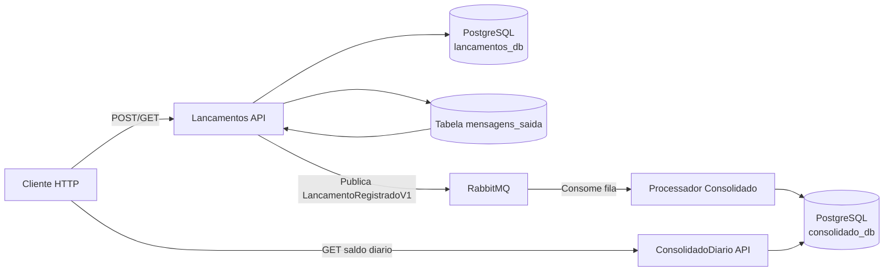
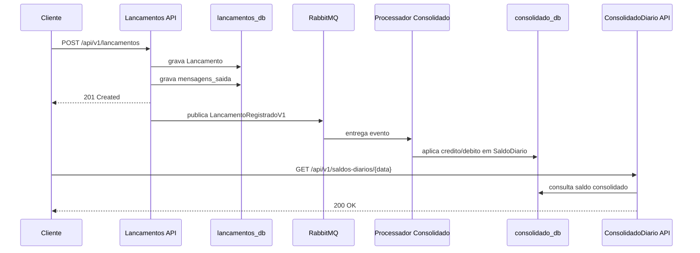
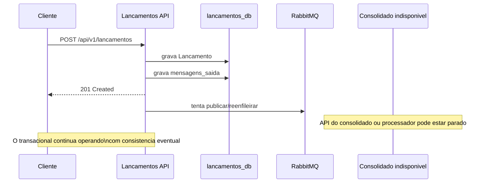

# Diagramas

Diagramas simples para leitura rapida da arquitetura e do fluxo principal implementado no repositorio.

## Componentes

## Sequencia do fluxo principal

## Comportamento esperado em falha

